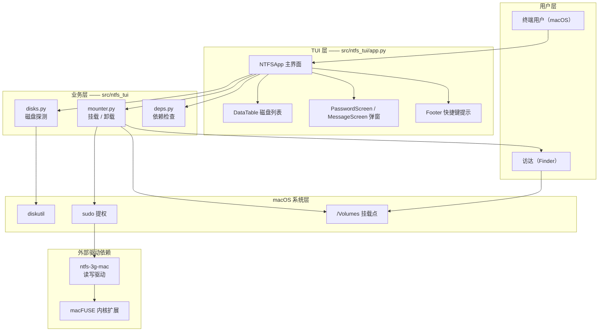
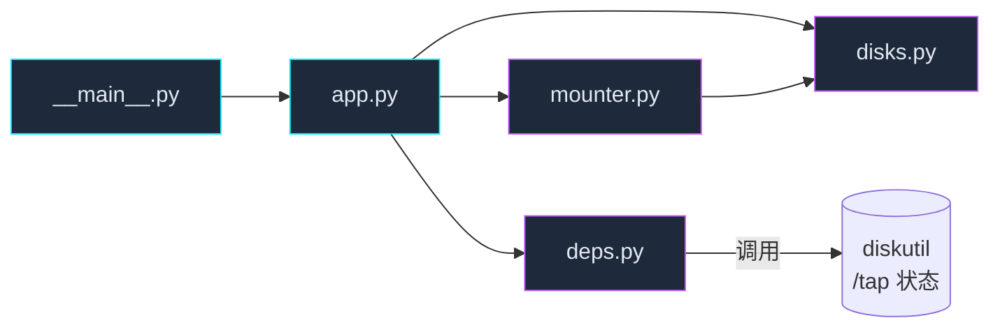
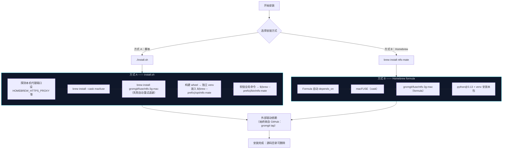
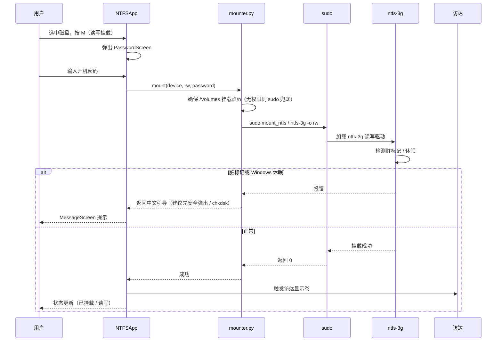

# NTFS Mate —— 项目架构图

> macOS 上的 NTFS 磁盘读写 / 可视化终端工具（TUI）。
> 本文档描述系统分层、模块职责、安装路径与运行时数据流，供维护与二次开发参考。

---

## 1. 目录结构

```
ntfs-for-mac-cli/
├── ntfs-mate            # 开发启动入口（指向源码 .venv，非安装产物）
├── install.sh           # 一键安装脚本（网络稳健：自动探测代理 + 重试）
├── pyproject.toml       # 打包定义（版本单一数据源 / console_scripts / 测试配置）
├── Formula/
│   └── ntfs-mate.rb     # Homebrew formula（brew install 一条命令装全）
├── src/ntfs_tui/        # 应用源码
│   ├── __main__.py      # 入口：调用 app.main()
│   ├── app.py           # TUI 主程序（界面布局 + Textual CSS 样式 + 交互逻辑）
│   ├── disks.py         # 磁盘探测（diskutil / 卷名 / 设备 / 挂载状态）
│   ├── mounter.py       # 挂载 / 卸载（sudo + ntfs-3g，含脏标记/休眠引导）
│   └── deps.py          # 依赖检查（macFUSE / ntfs-3g / 版本）
├── tests/               # 35 个 pytest 用例（deps / disks / mounter / app smoke）
├── docs/superpowers/    # 设计稿与实现计划（specs / plans）
├── README.md            # 使用说明
├── CHANGELOG.md         # 语义化版本变更记录
└── LICENSE              # 开源协议
```

> `.venv/`（运行时虚拟环境）与 `build/`（构建产物）已被 `.gitignore` 忽略，不入库。

---

## 2. 系统分层架构



---

## 3. 模块依赖关系



| 模块 | 职责 | 依赖 |
|---|---|---|
| `__main__.py` | 程序入口，调用 `app.main()` | app |
| `app.py` | TUI 主界面、表格、弹窗、快捷键、全部交互逻辑与样式 | disks / mounter / deps |
| `disks.py` | 通过 `diskutil` 探测 NTFS 磁盘、卷名、设备路径、挂载状态 | 系统 diskutil |
| `mounter.py` | 以 `sudo` 调用 `ntfs-3g` 完成挂载/卸载；处理脏标记、Windows 休眠引导；`/Volumes` 建点 sudo 兜底 | disks / sudo / ntfs-3g |
| `deps.py` | 校验 macFUSE、ntfs-3g 是否就绪并给出中文修复建议 | diskutil / brew |

---

## 4. 安装 / 部署架构（两条路径）



**关键说明**

- 方式 A 与方式 B 最终都把应用装入 `$(brew --prefix)/opt/ntfs-mate` 并注册全局命令，**源码目录可整体删除**。
- macFUSE 与 ntfs-3g 这两个真正"卡网络"的驱动**始终来自 GitHub**（gromgit tap），因此最终用户安装驱动仍需代理；`install.sh` 已内置代理自动探测，formula 在 caveats 中提示配置代理。
- 源码可托管于任意 git 平台（GitHub / Gitee / 自建），仅影响自家代码下载速度，不改变驱动来源。

---

## 5. 运行时挂载数据流（时序）



---

## 6. 外部依赖一览

| 依赖 | 类型 | 来源 | 作用 |
|---|---|---|---|
| `macFUSE` | Homebrew cask | GitHub `macFUSE/macFUSE` | NTFS 内核扩展框架（首次需系统设置授权） |
| `ntfs-3g-mac` | Homebrew formula | `gromgit/fuse` tap（GitHub / ghcr.io） | 实际的 NTFS 读写驱动 |
| `python@3.13` | Homebrew formula | Homebrew core | 运行 TUI（Textual 8.x） |
| `Textual` | PyPI 包 | PyPI（pip） | TUI 框架 |

---

## 7. 版本与状态

- 当前版本：**0.3.0**（语义化版本，单一数据源在 `pyproject.toml`）。
- 入口命令：`ntfs-mate`（全局）、`ntfs-mate -v`（版本）、`ntfs-mate -h`（帮助）。
- 测试：35 个 pytest 用例全绿，覆盖 deps / disks / mounter / app 冒烟。
- 版本基线：**v0.3.0**（遵循语义化版本，后续发布按 `vX.Y.Z` 打 tag；标签历史自本次托管重新起算，不再保留 v0.2.x 旧标签）。
