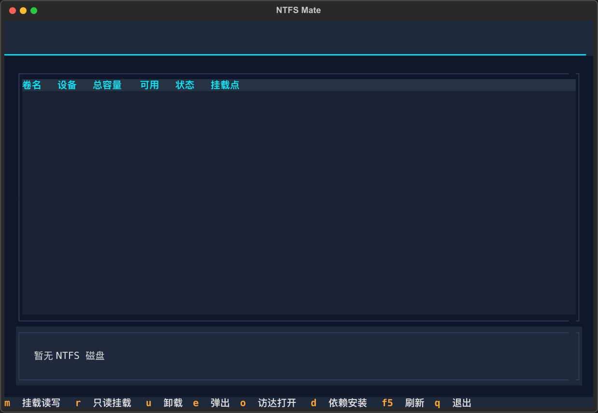

# NTFS Mate

macOS 上的 NTFS 硬盘读写工具 — 终端可视化（TUI）界面，让 NTFS 硬盘在访达中正常读、写、删除、挂载、弹出。


## 界面预览



主界面实时列出所有 NTFS 磁盘，显示卷名、设备、总容量 / 可用空间、挂载状态（未挂载 / 只读 / 读写）与挂载点，每 3 秒自动刷新；↑↓ 或鼠标选中磁盘后，即可通过快捷键进行读写挂载、卸载、弹出、访达打开等操作。

## 功能

- **可视化磁盘列表**：卷名、设备、总容量/可用空间、挂载状态（未挂载/只读/读写）、挂载点，每 3 秒自动刷新（热插拔即时可见）
- **一键读写挂载**：基于 macFUSE + ntfs-3g，挂载后在访达中正常读、写、删除
- **只读挂载 / 卸载 / 弹出整盘 / 访达打开**
- **智能错误引导**：Windows 休眠、NTFS 脏标记等常见问题给出中文处理建议
- **一键安装**：`install.sh` 自动装齐全部依赖（含代理自适应与重试）
- **Homebrew 安装**：支持 `brew install ntfs-mate`，一条命令装全

## 支持环境

- **CPU 架构**：Intel（x86_64）与 Apple Silicon（arm64）均支持，无需区分。Apple Silicon 机型**首次**需进入恢复模式、将安全策略降为「降低安全性 / 允许用户管理内核扩展」一次，才能加载 macFUSE 内核扩展（之后正常使用）。
- **macOS 版本**：macOS 11 Big Sur 及以上（已在 macOS 26.1 Tahoe 上验证）。底层依赖 macFUSE 内核扩展本身支持 macOS 10.9+；Sequoia 15 / Tahoe 26 等较新系统在「系统设置 → 隐私与安全性」中需手动允许 macFUSE 内核扩展（仅首次）。
- **安装位置自适应**：无论 Intel（`/usr/local`）还是 Apple Silicon（`/opt/homebrew`），脚本与 formula 均通过 `brew --prefix` 自动适配，用户无需手动区分路径。

> 说明：本工具的应用本体为纯 Python（≥3.9）+ Textual，**本身不绑定特定 macOS 版本或 CPU 架构**；所有平台差异都来自底层 macFUSE / ntfs-3g 内核驱动，由 Homebrew 统一处理。

## 安装

> 两种安装方式，按「是否需要下载源码」选择：
> - **方式一（推荐）**：通过 Homebrew 安装，**不需要下载本仓库代码**，终端任意目录一条命令搞定。
> - **方式二**：从本仓库源码安装，**需要先把仓库克隆到本地**，适合想本地改代码的开发者。

### 方式一：Homebrew 安装（推荐，无需下载代码）

ntfs-mate 依赖 **macFUSE** 内核框架才能读写 NTFS，请**先把它装好再继续**（否则下一步 `brew install ntfs-mate` 会直接报错退出）。无需克隆仓库，在终端**任意目录**执行：

**① 安装底层依赖 macFUSE（必装，否则装不了 ntfs-mate）**

```bash
brew install --cask macfuse
```

> 装完还需在系统设置里批准其内核扩展（见文末"首次使用必读"），建议现在就做——它要重启一次，早点弄完不耽误后面用。

**② 安装 ntfs-mate**

```bash
# 添加 tap（公式在主仓库，需显式指定 git URL，否则 Homebrew 默认找 homebrew-* 仓库会 404）
brew tap Rock-Legend/ntfs-for-mac-cli https://github.com/Rock-Legend/ntfs-for-mac-cli.git

# 信任该 tap（来自非官方 tap 的公式需先信任，否则 brew 拒绝安装）
brew trust rock-legend/ntfs-for-mac-cli

# 安装（自动拉取 gromgit/fuse/ntfs-3g-mac 并注册到 $(brew --prefix)/bin）
brew install ntfs-mate
```

### 方式二：从源码本地安装（需先克隆仓库）

适合想本地修改代码的开发者。先克隆并进入仓库：

```bash
git clone https://github.com/Rock-Legend/ntfs-for-mac-cli.git
cd ntfs-for-mac-cli
```

然后在仓库目录内任选一种：

**A. 用仓库自带的 Formula 安装**

```bash
brew install --formula ./Formula/ntfs-mate.rb
```

**B. 用安装脚本一键装齐（推荐本地开发）**

```bash
./install.sh
```

脚本自动完成：

1. `brew install --cask macfuse`（NTFS 内核驱动框架；方式一需你手动装，这里自动装）
2. `brew install gromgit/fuse/ntfs-3g-mac`（NTFS 读写驱动）
3. 从源码构建 wheel，装入独立运行环境 `$(brew --prefix)/opt/ntfs-mate/`
4. 注册全局命令 `$(brew --prefix)/bin/ntfs-mate`

> ✅ **安装完成后本仓库目录即可删除**，应用与源码完全无关。

### 首次使用必读（两种方式都适用）

> ⚠️ **macFUSE 需授权内核扩展（仅首次）**：
> 系统设置 → 隐私与安全性 → 允许 "macFUSE"（Benjamin Fleischer），按提示重启一次。
> Apple Silicon 机型还需先在恢复模式中允许第三方内核扩展（降低安全策略一次）。

> 🌐 **GitHub 网络超时（国内常见）**：macFUSE / ntfs-3g 的下载与编译都来自 GitHub / tuxera / ghcr.io，直连极易超时。请先为 brew 配置代理：
> ```bash
> export HOMEBREW_HTTPS_PROXY=http://127.0.0.1:7897
> export HOMEBREW_HTTP_PROXY=http://127.0.0.1:7897
> ```
> `./install.sh` 会自动探测本机代理端口（Clash/Surge 等）并仅为本次安装启用，无需手动设置。

## 卸载

卸载命令取决于你当初的安装方式（见上方「安装」）。底层驱动 macFUSE / ntfs-3g-mac 始终由 Homebrew 管理，两种方式通用。

### 仅卸载 ntfs-mate 应用（保留驱动）

- **通过 Homebrew 安装（方式一 / 方式二-A）**：

  ```bash
  brew uninstall ntfs-mate
  ```

  > ⚠️ 不要对 brew 安装执行 `ntfs-mate uninstall`：该命令检测到 brew 安装会拒绝执行，并提示改用上面这条。

- **通过 install.sh 手动安装（方式二-B）**：

  ```bash
  ntfs-mate uninstall        # 交互确认后移除全局命令与应用本体
  # 或仓库目录下载到电脑本机中时：
  ./uninstall.sh
  ```

### 完整卸载（连底层驱动一并移除）

应用本体按安装方式选对应命令，底层驱动两种方式都通用（macFUSE 内核扩展需**重启一次**才完全卸除）：

```bash
# 1) 卸载应用本体（二选一，按安装方式）
brew uninstall ntfs-mate          # 方式一 / 方式二-A（brew 安装）
# ntfs-mate uninstall             # 方式二-B（install.sh 安装）；或 ./uninstall.sh

# 2) 卸载底层驱动（两种方式通用）
brew uninstall ntfs-3g-mac
brew uninstall --cask macfuse
```

如不再需要该 tap，最后执行：`brew untap Rock-Legend/ntfs-for-mac-cli`


## 使用

终端**任意目录**直接运行：

```bash
ntfs-mate
```

| 快捷键 | 动作 |
|---|---|
| `M` | 挂载为读写（需输入开机密码一次，挂载后访达可读/写/删除） |
| `R` | 只读挂载（macOS 原生，无需密码） |
| `U` | 卸载 |
| `E` | 弹出整盘（可安全拔出） |
| `O` | 在访达中打开 |
| `D` | 依赖状态 / 安装引导 |
| `F5` | 手动刷新 |
| `Q` | 退出 |

↑↓ 或鼠标选择磁盘。

## 常见问题

- **挂载失败提示「Windows 休眠文件」**：在 Windows 中彻底关机（设置 → 电源 → 关闭「快速启动」）后重试。
- **提示「NTFS 日志未正常关闭」**：上次未安全弹出，在 Windows 中运行 `chkdsk /f` 修复后重试。
- **挂载后访达看不到盘**：确认已允许 macFUSE 内核扩展（见上方安装说明）。

## 真机验证清单

1. 插入 NTFS 移动硬盘 → 列表 3 秒内出现，状态显示「只读」（macOS 默认）
2. 选中按 `M` → 输入开机密码 → 状态变为「读写」
3. 按 `O` 打开访达 → 新建文件夹、拷入文件、删除文件均正常
4. 按 `U` 卸载 → 访达中消失；按 `E` 弹出 → 整盘断电可拔出

## 开发

```bash
# 开发环境（可编辑安装 + 测试依赖）
python3 -m venv .venv
.venv/bin/pip install -e ".[dev]"

# 运行测试（不触碰真实磁盘，全部 mock）
.venv/bin/pytest -v
```

版本发布规范：版本号只改 `pyproject.toml`，提交后打 `git tag v<x.y.z>`，并在 CHANGELOG.md 记录。

项目结构：

```
pyproject.toml      打包定义（版本/依赖/console_scripts/pytest 配置，单一数据源）
Formula/ntfs-mate.rb Homebrew formula（brew install 一条命令装全）
install.sh          一键安装到系统标准位置（原子替换，失败不留半成品，代理自适应+重试）
uninstall.sh        卸载脚本（仅适用于 install.sh 安装，与 ntfs-mate uninstall 等效；brew 安装请用 brew uninstall ntfs-mate）
ntfs-mate           开发期启动入口（项目内 .venv）
LICENSE / CHANGELOG.md
src/ntfs_tui/
  ├── app.py        Textual TUI 主界面 + CLI 入口（-v/-h/uninstall）
  ├── disks.py      磁盘探测（diskutil plist 解析）
  ├── mounter.py    挂载/卸载/弹出 + 错误引导
  └── deps.py       依赖检测
tests/              单元测试 + TUI headless 冒烟
docs/               设计文档与实现计划
```

## 已知限制

- ntfs-3g 为 FUSE 用户态驱动，大文件连续读写性能低于原生或商业驱动（Paragon/Tuxera）；本工具已默认开启 `big_writes` + `noatime` 缓解，大量小文件场景仍偏慢（每次操作有用户态往返开销）。极致性能可换 Tuxera NTFS 或 Paragon NTFS（内核态驱动）
- Apple Silicon 需一次性降低安全策略以加载 macFUSE kext
- 开启 Windows「快速启动」或处于休眠状态的盘需先处理（工具内会给出引导）
